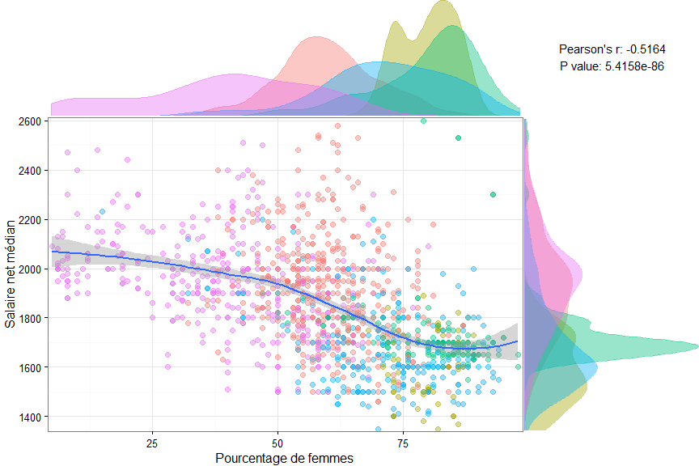
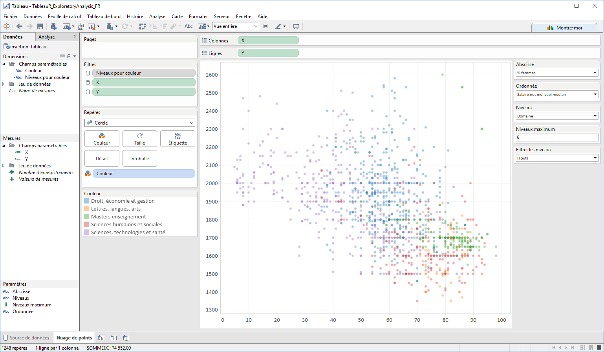
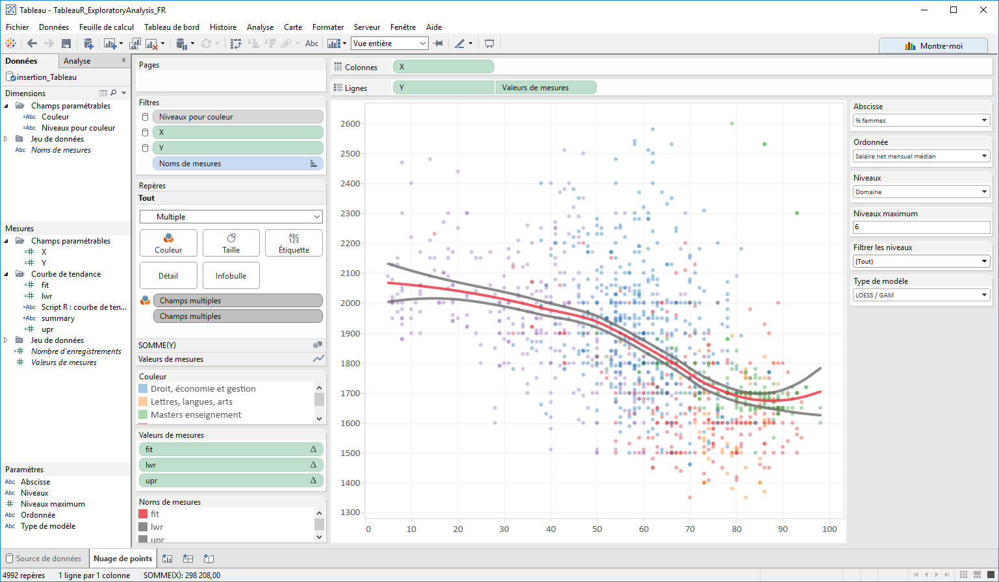
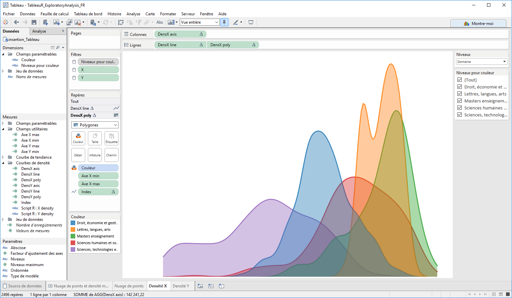
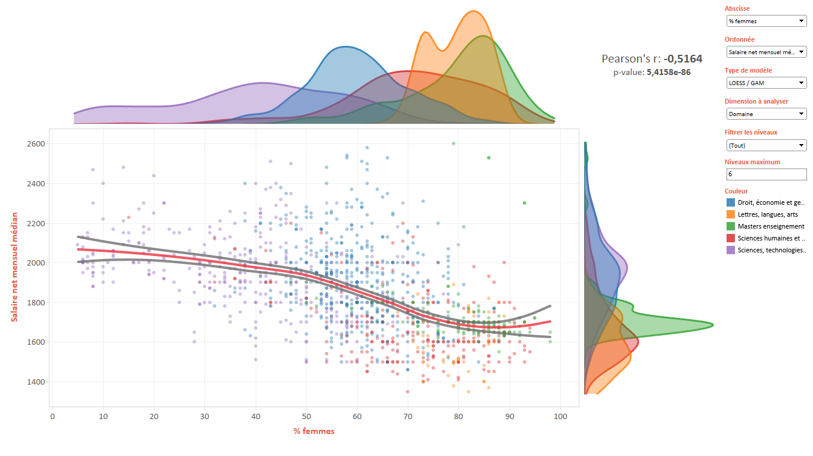

# Un outil d'analyse exploratoire avec Tableau et R
[Simon Keith](Profil publichttps://fr.linkedin.com/in/simonkth), [Actinvision](http://www.actinvision.fr/)  
16 mars 2016  
<br>  

# Introduction
### Vous avez dit analyse exploratoire ?
Lorsque l'on met la main sur un nouveau jeu de données, que ce soit dans une optique de reporting ou dans le but de réaliser des analyses plus avancées, il est préférable de passer un peu de temps sur l'exploration des données avant de se lancer plus en avant dans un projet analytique. C'est une bonne façon de comprendre et de se familiariser avec les données, et cela permet aussi de prendre du recul et d'éviter de se lancer dans une analyse biaisée par les idées préconçues que l'on peut avoir.  

Si on commence un projet de data visualisation en ayant défini une maquette sans explorer les données, on risque de passer à côté de la découverte d'informations intéressantes : on ne trouvera que ce que l'on veut trouver. Quand on passe sur un projet de [data science](http://www.decideo.fr/L-apprentissage-automatique-ou-comment-les-ordinateurs-apprennent-a-partir-des-donnees_a8338.html), cela devient indispensable : passer du temps sur l'exploration des données permettra ainsi de contrôler la qualité des données, d'identifier les variables intéressantes, de définir les éventuelles transformations à appliquer, ou encore de choisir les meilleurs outils statistiques pour la suite de l'analyse. D'ailleurs, la plupart des [modèles](https://fr.wikipedia.org/wiki/Cross_Industry_Standard_Process_for_Data_Mining) de gestion de projets "data" s'accordent sur l'importance de l'analyse exploratoire dans le processus de développement.  
<br>  

### Pourquoi Tableau est un bon candidat
J'ai l'habitude de travailler avec R, et R propose de très bonnes librairies pour l'analyse exploratoire. Côté data visualisation, on a l'incontournable [_ggplot2_](http://docs.ggplot2.org/) qui, avec un peu d'expérience, permet déjà de réaliser de belles choses. Vous pouvez ensuite transformer vos réalisations en applications web interactives avec des outils comme [Plotly](https://plot.ly/r/) ou [Shiny](http://shiny.rstudio.com/). Ces outils sont formidables pour un data scientist qui souhaite rapidement proposer des visualisation interactives de son travail, sans avoir besoin de compétences en développement web. L'avantage est de pouvoir travailler rapidement, avec des outils open-source, et surtout sans aucune limitation au niveau du traitement et de la manipulation des données.  

En revanche, ces outils s’adressent malgré tout principalement à des développeurs R (ou Python et autres pour Plotly). Pour un utilisateur classique, les outils BI "as a service" comme Tableau restent tout de même plus adaptés. Depuis sa version 8.1, Tableau propose une intégration avec R. J'ai pu entendre plusieurs personnes qualifier cette fonctionnalité de "gadget", et dans un sens je ne peux être complètement en désaccord. En effet, cela ne transforme clairement pas Tableau en un environnement pour la programmation scientifique et les statistiques avancées — Tableau reste avant tout un outil de data visualisation. Pour autant rien n'empêche de pré-programmer de nouvelles fonctionnalités en R et de les rendre disponibles à nos data analysts et à nos experts Tableau. Je suis persuadé que R peut ainsi considérablement renforcer Tableau dans le domaine de l'analyse exploratoire, et c'est ce que je vais tenter de montrer dans ce billet de blog.  

L'article est pensé pour rester vivant, c'est pourquoi il est hébergé sur mon compte Github. Au fur et à mesure que les idées d'utilisation de R dans Tableau me viendront, je les ajouteraient au répertoire et l'article sera automatiquement mis à jour. Au final, le but est de construire un ou plusieurs classeurs Tableau contenant des propositions de vues exploitant du code R, et de fournir toutes les éléments nécessaires à la reproduction de ces vues en utilisant vos données.  

Dans chaque cas j'essaye de penser mon code R pour qu'il puisse s'adapter à un maximum de situations, cependant si vous avez des difficultés n'hésitez pas à [me contacter](mailto:skeith@actinvision.com).  
<br>  

### Prérequis
Tous les fichiers sont disponibles dans ce [répertoire Github](https://github.com/simonkth/TableauR_ExploratoryAnalysis).  
Si vous souhaitez reproduire cet outil, assurez-vous de remplir les prérequis suivants avant de continuer :  

* avoir installé une version de Tableau Desktop supportant l'intégration avec R (8.1 ou supérieure, 9.3 recommandée)  
      + vous pouvez vous procurer une version d'essai à [cette adresse](http://get.tableau.com/fr-fr/partner-trial.html?partner=29294)  
* avoir installé R version 3.0.2 ou supérieure (disponible [ici](https://www.r-project.org/))  
* avoir ajouté R à votre variable d'environnement _path_ (par exemple, "_C:\\Program Files\\R\\R-3.0.2\\bin\\x64_")  
* avoir lancé Rserve en tâche d'arrière plan  
      + pour une configuration rapide et suffisante dans notre cas, téléchargez le contenu du [répertoire Github](https://github.com/simonkth/TableauR_ExploratoryAnalysis) et double-cliquez sur _Rserve.cmd_ dans le dossier _Rserve_ (ne fermez pas la fenêtre qui s'ouvre)  
      + pour une installation plus durable et plus flexible, suivez [ces instructions](http://kb.tableau.com/articles/knowledgebase/r-implementation-notes?lang=fr-fr)  
<br>  

# Jeu de données
### Origine et description
Le jeu de données que nous allons utiliser pour cette démonstration provient de la plateforme ouverte des [données publiques françaises](https://www.data.gouv.fr/fr/). Il contient un certain nombre d'indicateurs concernant l'insertion professionnelle des diplômés de Master en universités, fournis par le site de l'[enseignement supérieur français](www.enseignementsup-recherche.gouv.fr).  

Le jeu de données brut et sa documentation sont disponibles [ici](https://www.data.gouv.fr/fr/datasets/insertion-professionnelle-des-diplomes-de-master-en-universites-et-etablissements-assimil-0/).  
<br>  

### Nettoyage et préparation avec R
Si le travail de préparation des données ne vous intéresse pas et que vous souhaitez directement attaquer les manipulations dans Tableau, vous pouvez passer cette section.  

Sinon, n'oubliez pas de configurer au préalable votre répertoire de travail avec la fonction `setwd`.  

Nous commençons par télécharger les données, puis nous réglons les problèmes de qualité des données. Nous supprimons ensuite les cas où le nombre de réponses est inférieur à 30, ainsi que ceux où le taux de réponse est inférieur à 30%. Nous sélectionnons également les colonnes qui nous intéressent. Enfin, nous exportons un fichier _.csv_ pour Tableau et nous affichons un échantillon des données.  

```r
# load packages
if (!require("pacman")) install.packages("pacman")
pacman::p_load(downloader, data.table, dplyr)

# download and load the data (Windows setup)
if(!file.exists("./data/insertion_raw.csv")) {
      if(!file.exists("./data")) {dir.create("./data")}
      dataUrl <- paste0("https://data.enseignementsup-recherche.gouv.fr/explore/dataset/", 
                        "fr-esr-insertion_professionnelle-master/download?format=csv")

      download(dataUrl, dest="./data/insertion_raw.csv", mode="wb", quiet=TRUE)
} else message("The dataset had previously been downloaded.")

# read data with fread(), with list of strings to ignore
insertion <- fread("./data/insertion_raw.csv", sep=";", encoding="UTF-8", 
                  na.strings=c("NA", "ns", "nd", "fe", ".", paste0(1, "\U00A0", 710), ""))

# remove data if sample is too small (nombre_de_reponses < 30) 
# or if the response rate is too low (taux_de_reponse < 30)
# also remove fields that we don't want to keep in Tableau
insertion <- insertion %>% 
      dplyr::filter(nombre_de_reponses >= 30, taux_de_reponse >= 30, 
             numero_de_l_etablissement != "UNIV") %>%
      dplyr::select(-c(numero_de_l_etablissement, code_de_l_academie, code_du_domaine, 
                code_de_la_discipline, remarque, cle_etab, cle_disc))

# export data in csv for Tableau
# note: we remove R "NAs" and replace with empty cells since Tableau doesn't handle them
insertion_noNa <- insertion
insertion_noNa[is.na(insertion_noNa)] <- ""
write.csv(insertion_noNa, "./data/insertion_Tableau.csv", row.names=FALSE)
remove(insertion_noNa)

# show sample
str(insertion)
```

```
## Classes 'data.table' and 'data.frame':	2177 obs. of  23 variables:
##  $ annee                                        : int  2012 2012 2012 2012 2012 2012 2012 2012 2012 2012 ...
##  $ etablissement                                : chr  "Saint-Etienne - Jean Monnet" "Saint-Etienne - Jean Monnet" "Strasbourg" "Toulon - Sud Toulon Var" ...
##  $ academie                                     : chr  "Lyon" "Lyon" "Strasbourg" "Nice" ...
##  $ domaine                                      : chr  "Droit, économie et gestion" "Droit, économie et gestion" "Sciences, technologies et santé" "Droit, économie et gestion" ...
##  $ discipline                                   : chr  "Ensemble formations juridiques, économiques et de gestion" "Autres formations juridiques, économiques et de gestion" "Informatique" "Gestion" ...
##  $ situation                                    : chr  "18 mois après le diplôme" "18 mois après le diplôme" "18 mois après le diplôme" "18 mois après le diplôme" ...
##  $ nombre_de_reponses                           : int  147 65 38 37 89 46 35 39 41 59 ...
##  $ taux_de_reponse                              : int  76 82 81 73 69 71 85 66 78 88 ...
##  $ poids_de_la_discipline                       : int  55 24 4 21 28 9 9 11 10 100 ...
##  $ taux_dinsertion                              : int  92 93 92 81 86 96 79 80 79 98 ...
##  $ emplois_cadre_ou_professions_intermediaires  : int  80 79 97 73 56 88 NA 74 90 89 ...
##  $ emplois_stables                              : int  64 63 82 47 58 79 NA 53 42 79 ...
##  $ emplois_a_temps_plein                        : int  98 96 100 100 83 95 NA 79 65 93 ...
##  $ salaire_net_median_des_emplois_a_temps_plein : int  1720 1730 NA NA 1380 1940 NA NA NA 1650 ...
##  $ salaire_brut_annuel_estime                   : int  26800 27000 NA NA 21500 30300 NA NA NA 25700 ...
##  $ de_diplomes_boursiers                        : int  31 31 23 40 37 40 27 27 27 42 ...
##  $ taux_de_chomage_regional                     : num  8.9 8.9 9.3 11.7 10.5 10.5 9.8 9.8 9.8 8.9 ...
##  $ salaire_net_mensuel_median_regional          : int  1780 1780 1760 1790 1760 1760 1780 1780 1780 1780 ...
##  $ emplois_cadre                                : int  45 42 93 26 39 74 NA 41 80 80 ...
##  $ emplois_exterieurs_a_la_region_de_luniversite: int  35 32 45 22 52 27 NA 63 62 8 ...
##  $ femmes                                       : int  53 60 7 75 79 54 51 87 85 88 ...
##  $ salaire_net_mensuel_regional_1er_quartile    : int  1430 1430 1430 1390 1420 1420 1460 1460 1460 1430 ...
##  $ salaire_net_mensuel_regional_3eme_quartile   : int  2130 2130 2080 2170 2090 2090 2110 2110 2110 2130 ...
##  - attr(*, ".internal.selfref")=<externalptr>
```
_Dernière date de téléchargement du jeu de données : 2016-03-30 11:41:36._  
<br>  

# Développement des outils d'analyse
### Nuage de points et densitées marginales
L'un de mes premiers réflexes lorsque j'explore un nouveau jeu de données est de rechercher des relations entre les différentes variables. Pour les variables quantitatives, le nuage de point est un incontournable. Sur ce type de graphique, j'ai également tendance à utiliser la couleur pour comparer les différents niveaux d'une variable qualitative (ou dimension).  

Le problème avec les nuages de points, c'est qu'ils ont tendance à devenir rapidement illisibles lorsqu'il y a beaucoup d'éléments à afficher. Il est donc intéressant d'enrichir ces vues. On peut ainsi y ajouter différents éléments : une courbe de tendance, le résultat d'un test statistique, ou encore les densités marginales de nos variables... Ce nuage de point amélioré sera ma première proposition de vue intégrant du code R dans Tableau.  

Ci-dessous une petite démonstration rapide en R avec le package _ggplot2_. J'ai ajouté une courbe de régression [LOESS](https://en.wikipedia.org/wiki/Local_regression), le résultat d'un [test de corrélation de Pearson](https://en.wikipedia.org/wiki/Pearson_product-moment_correlation_coefficient) ainsi que les [distributions marginales](https://en.wikipedia.org/wiki/Marginal_distribution) déclinées en couleurs sur les différents domaines d'études proposés par nos universités. C'est une démonstration rapide, je n'ai donc pas pris la peine d'afficher la légende. Vous remarquerez aussi que cela demande beaucoup de code, et que l'alignement des différents éléments reste assez approximatif.  

```r
# load packages for graphics
pacman::p_load(ggplot2, gridExtra)

# set variables
graphData <- data.frame(
      axisX=insertion$femmes,
      axisY=insertion$salaire_net_median_des_emplois_a_temps_plein, 
      colDim=insertion$domaine
      )
graphData <- graphData[complete.cases(graphData),]
axisNames <- c("Pourcentage de femmes", "Salaire net médian")

# helper function for graphic themes
myTheme <- function(...) theme(legend.position="none", 
                               panel.background=element_blank(), 
                               panel.grid.major=element_blank(), 
                               panel.grid.minor=element_blank(), 
                               panel.margin=unit(0, "null"), 
                               axis.ticks=element_blank(), 
                               axis.text.x=element_blank(), 
                               axis.text.y=element_blank(), 
                               axis.title.x=element_blank(), 
                               axis.title.y=element_blank(), 
                               panel.border=element_rect(color=NA), ...)

# plotting Pearson's correlation test
corTest <- with(graphData, cor.test(axisX, axisY, method="pearson"))
corText <- paste0("Pearson's r: ", formatC(corTest$estimate, digits=4, format="f"), 
                  "\np value: ", formatC(corTest$p.value, digits=4, format="e"))
gText <- ggplot() + 
  annotate("text", x=0, y=0, size=4, label=corText) + 
  theme_bw() + myTheme()

# scatterplot with LOESS smooth line
g1 <- ggplot(graphData, aes(x=axisX, y=axisY, colour=factor(colDim))) +
      geom_point(alpha=0.4, size=1.5) + 
      geom_smooth(aes(x=axisX, y=axisY), 
                  inherit.aes=FALSE, method="loess") +
      scale_x_continuous(expand=c(0.01, 0.01)) +
      scale_y_continuous(expand=c(0.01, 0.01)) +
      theme_bw() + xlab(axisNames[1]) + ylab(axisNames[2]) +
      theme(legend.position="none", plot.margin=unit(c(1, 1, 1, 1), "points"))

# x marginal density
g2 <- ggplot(graphData, aes(x=axisX, colour=factor(colDim), fill=factor(colDim))) + 
  geom_density(alpha=0.4) + 
  scale_x_continuous(breaks=NULL, expand=c(0.01, 0.01)) +
  scale_y_continuous(breaks=NULL, expand=c(0, 0)) +
  theme_bw() +
  myTheme(plot.margin=unit(c(0, 0, 0, 3), "lines")) 

# y marginal density
g3 <- ggplot(graphData, aes(x=axisY, colour=factor(colDim), fill=factor(colDim))) + 
  geom_density(alpha=0.4) + 
  coord_flip()  + 
  scale_x_continuous(labels=NULL, breaks=NULL, expand=c(0.01, 0.01)) +
  scale_y_continuous(labels=NULL, breaks=NULL, expand=c(0, 0)) +
  theme_bw() +
  myTheme(plot.margin=unit(c(0, 0, 2.1, 0), "lines"))

# arrange plots
grid.arrange(arrangeGrob(g2, gText, ncol=2, widths=c(3, 1)), 
             arrangeGrob(g1, g3, ncol=2, widths=c(3, 1)), 
             heights=c(1, 3))
```


<br>  

Bien entendu ce code pourrait être largement amélioré (ajout de la légende, alignement dynamique des différents éléments, etc.) mais vous avez compris le problème : c'est difficile à maintenir, et surtout cela manque cruellement d’interactivité. Je peux changer mes variables, mais pour cela je dois modifier puis relancer mon code. De plus, je ne suis pas sûr que l'alignement de mes graphiques restera bon. Je n'ai pas non plus la possibilité d'ajouter des infobulles ni de filtrer mes données... Bref, et si l'on essayait de porter tout cela dans Tableau ?  
<br>  

#### Mise en place
Vous trouverez le classeur Tableau dans le [répertoire Github](https://github.com/simonkth/TableauR_ExploratoryAnalysis) (_TableauR_ExploratoryAnalysis_FR.twb_). Je ne vais pas détailler tous les champs calculés, aussi je vous conseille de travailler avec deux fenêtres de Tableau. Dans la première, ouvrez mon classeur et jetez y un coup d’œil de temps en temps pour voir comment je m'y suis pris. Dans la deuxième, ouvrez un classeur vierge et recommencez à partir de zéro.  

La première étape est de se connecter aux données (fichier _insertion_Tableau.csv_). N'hésitez pas à renommer les champs et à formater correctement les mesures, comme je l'ai fait. Puis nous passons au premier élément, le nuage de points.  
<br>  

#### Nuage de points amélioré
D'abord, n'oubliez pas de désactiver l'agrégation dans _Analyse_ $\rightarrow$ _Agréger les mesures_. Ensuite, le premier réflexe est de dynamiser notre vue en créant un certain nombre de paramètres, ainsi que les champs paramétrables correspondants. Faites _clique-droit_ $\rightarrow$ _modifier_ pour comprendre comment ils sont construits. Pour le nuage de points, nous avons donc :  

* le paramètre __Abscisse__ qui commande le champ __X__  
* le paramètre __Ordonnée__ qui commande le champ __Y__  
* les paramètres __Niveaux__ et __Niveaux maximum__ qui commandent les champs __Niveaux pour couleur__ et __Couleur__  

Grâce aux deux premiers paramètres, je peux choisir les mesures que je souhaite placer en abscisse et en ordonnée. Quelques précisions s'imposent pour le dernier point. Grâce à __Niveaux__, je peux choisir une dimension pour déterminer la couleur des points (via le champ __Niveaux pour couleur__). Cependant je ne contrôle pas le nombre de niveaux que contient cette dimension ! Par sécurité, je crée un nouveau couple paramètre / champ calculé (__Niveaux maximum__ et __Couleur__) qui va me permettre de n'afficher des couleurs que si le nombre de niveaux ne dépasse pas un certain seuil. C'est donc le champ __Couleur__ que je place sur mon repère des couleurs. En revanche, je peux utiliser le champ __Niveaux pour couleur__ pour filtrer ma dimension. Ainsi, bien qu'il y ait 28 niveaux pour la dimension __Académie__, si je la sélectionne puis que je filtre pour ne garder que 6 niveaux (et que __Niveaux maximum__ est fixé à 6), les académies que j'ai sélectionnées vont bel et bien s'afficher en couleur. En revanche si j'ajoute une académie de trop à ma sélection, Tableau repasse sur une couleur unique.  

Notez que j'utilise un _LOD_ de type _FIXED_ pour pouvoir faire du champ __Couleur__ une dimension. Cela sera important plus loin pour construire les densités marginales. De plus, le filtre __Niveaux pour couleur__ est placé en contexte afin de bien prendre en compte la diminution du nombre de niveaux lorsque j'en écarte certains. Je filtre également mes champs __X__ et __Y__ pour exclure les cas où les valeurs sont manquantes.  

  
<br>  

Passons à la courbe de tendance. Tableau propose déjà une solution, cependant l'idéal serait de pouvoir ajouter d'autres possibilités, comme la régression LOESS par exemple. Pour cela on va utiliser un paramètre permettant de choisir le type de modèle, et un script R pour réaliser les calculs. Dans cet exemple, je propose une régression LOESS, un modèle [GAM](https://en.wikipedia.org/wiki/Generalized_additive_model), ou une régression linéaire (modèle simple, logarithmique, ou polynomial de degré 2, 3 ou 4). Le paramètre se nomme __Type de modèle__.  

Notons deux points pour cette section. D'abord, je ne prends pas en compte les niveaux de la dimension qui déterminent la couleur : on souhaite afficher une seule courbe de tendance afin de ne pas surcharger le graphique, un modèle simple fera l'affaire. Ensuite, je souhaite non seulement obtenir la courbe de tendance, mais aussi un intervalle de confiance (95%). Je souhaite également obtenir le résumé du modèle, obtenu avec la fonction `summary`. Pour éviter de faire appel plusieurs fois à R, je concatène tous les résultats dans un seul champ de type chaîne de caractère que je pourrai ensuite [parser](https://fr.wiktionary.org/wiki/parser) dans Tableau.  

Le format final est donc : _lower___<___fit___>___upper___|S|___summary_  

```r
# Tableau variables
# values are given as an example here, replace with args in Tableau
x <- insertion$femmes
y <- insertion$salaire_net_median_des_emplois_a_temps_plein
modelType <- "loess/gam" # as an example

# fixed arguments and calculated variables
confLvl <- 0.95 # confidence interval
loessLimit <- 5000 # n limit for computing LOESS
n <- length(y)
modelType <- unlist(strsplit(modelType, "_", fixed=TRUE))

# remove missing values (only in R, do this with filters in Tableau)
complete <- complete.cases(x, y)
x <- x[complete]
y <- y[complete]


###### choose model ######

# LOESS/GAM cases
if(modelType[1] == "loess/gam") {
      # LOESS if dataset size is less than the limit
      if(n <= loessLimit) {
            model <- loess(y ~ x)
            pred <- predict(model, se=TRUE)
            # prepare data for trend line
            trendLine <- paste0(
                  pred$fit - (qt(1 - (1 - confLvl) / 2, pred$df) * pred$se), 
                  "<",
                  pred$fit, 
                  ">",
                  pred$fit + (qt(1 - (1 - confLvl) / 2, pred$df) * pred$se)
            )
      } else {
            # set modelType to GAM if dataset is too big
            modelType <- "gam"
      }
      
} else if(modelType[1] == "gam") {
      # if modelType was set to "gam", or to "loess/gam" with n > loessLimit, then compute GAM model
      if (!require(mgcv)) {
            install.packages("mgcv")
            require(mgcv)
      }
      # compute gam model...
      model <- gam(y ~ s(x, bs="cs")) # smoothing basis: cubic regression splines
      pred <- predict(model, type="link", se.fit=TRUE)
      DFE <- n - 1 # degrees of freedom
      # prepare data for trend line
      trendLine <- paste0(
            model$family$linkinv(pred$fit - ((qt(1 - (1 - confLvl) / 2, DFE) * pred$se.fit))), 
            "<",
            pred$fit, 
            ">",
            model$family$linkinv(pred$fit + ((qt(1 - (1 - confLvl) / 2, DFE) * pred$se.fit)))
      )

# linear model cases
} else if(modelType[1] == "lm") {
      # compute linear model with chosen formula
      # simple model case
      model <- if(modelType[2] == "lin") {
            lm(y ~ x)
      # log case
      } else if(modelType[2] == "log") {
            lm(y ~ log(x))
      # polynomial case
      } else if(modelType[2] == "pol") {
            # parse degree, evaluate orthogonal polynomials and return formula
            dg <- as.numeric(modelType[3])
            poly_x <- poly(x, degree=dg, raw=FALSE)
            lm(y ~ poly_x)
      }
      pred <- predict(model, interval="confidence", level=confLvl)
      # prepare data for trend line
      trendLine <- paste0(
            pred[, "lwr"],  
            "<",
            pred[, "fit"],  
            ">",
            pred[, "upr"]
      )
}

# capture model summary output
# Tableau will convert "\n" to new lines
modelSummary <- paste0(capture.output(summary(model)), collapse="\n")

# return data to tableau
invisible(paste0(trendLine, "|S|", modelSummary))
```
<br>  

Quelques modifications minimes permettent d'interfacer ce code dans Tableau (champ __Script R : courbe de tendance__) en utilisant la fonction _SCRIPT_STR_. Il faut ensuite parser ce champ pour obtenir les différents éléments :  

* le champ __lwr__ pour la limite basse de la courbe de tendance  
* le champ __fit__ pour la courbe de tendance  
* le champ __upr__ pour la limite haute de la courbe de tendance  
* le champ __summary__ pour le résumé du modèle  

Ignorez pour le moment les champs dont le nom commence par "cropped". Ensuite pour ajouter le tout dans la vue :  

1. glissez __Noms de mesures__ dans les filtres  
2. sélectionnez les champs __lwr__, __fit__ et __upr__  
3. glissez __Valeurs de mesures__ en lignes et créez un axe double (en synchronisant les axes)  
4. glissez __Noms de mesures__ en couleur dans le repère __Valeurs de mesures__, attribuez une couleur au champ __fit__ et une autre aux champs __lrw__ et __upr__  
5. enfin vous pouvez placer __summary__ en infobulle  

A ce stade votre vue devrait ressembler à la capture d'écran ci-dessous.  

  
<br>  

#### Densités marginales
Sur notre nuage de points, les densités marginales sont les fonctions de densité de nos composantes __X__ et __Y__. Par exemple si l'on prend une ligne au hasard dans notre jeu de données (soit une discipline pour une année et un établissement précis, valeurs nulles exclues) et que __X__ est le pourcentage de femmes, l'aire sous la fonction de densité de __X__ entre deux valeurs est la probabilité que le pourcentage de femmes soit compris entre ces deux valeurs. Ainsi si l'aire est de 0.4 entre 0% et 50%, cela signifie qu'il y a 40% de chances qu'il y ait moins d'une femme sur deux dans la discipline observée. Afficher les densités marginales aux marges de notre nuage de points nous permet de visualiser la répartition des points sur les axes __X__ et __Y__, même lorsque le graphique est très chargé et que de nombreux points se retrouvent superposés.  

Avant de construire ces courbes, il nous faut régler le problème de l'alignement. Les axes du nuage de points doivent être parfaitement alignés avec l'axe correspondant au niveau des densités marginales. Comme ce sont des vues différentes que nous allons intégrer dans un tableau de bord, il n'est pas possible de synchroniser les axes. À l'heure actuelle il n'est pas non plus possible de fixer les limites de l'axe dynamiquement dans Tableau, comme on le ferait en R (e.g. _xlim_ et _ylim_). Mais pas de panique ! Comme souvent avec Tableau, il existe une astuce. Nous allons créer 4 champs calculés qui nous permettront de placer des lignes de référence juste avant et après les limites de nos données. Tableau fait en sorte de toujours pouvoir afficher les lignes de référence dans la vue, cela nous permettra de forcer la plage des axes.  

La logique pour le calcul de ces champs est la suivante : on prend le minimum (ou le maximum) des données sur l'axe, et on y retranche (ou ajoute) une valeur proportionnelle à la plage des données. Un paramètre, __Facteur d'ajustement des axes__, nous permet de régler l'éloignement des lignes de référence par rapport aux données.  Les champs en question sont __Axe X max__, __Axe X min__, __Axe Y max__, __Axe Y min__.  J'utilise un _LOD Exclude_ pour ignorer le partitionnement par couleur. Vous pouvez déjà placer ces lignes de référence aux emplacements correspondants sur le nuage de points. Pour cela glissez les champs en détail et ajoutez des lignes de référence personnalisées.  

Passons au code R. Par défaut, les courbes de densité vont légèrement au delà de la plage des données, cela permet de faire tomber la densité à une valeur proche de zéro aux extrémités de la courbe. Cependant, nous ne voulons pas que les courbes dépassent le minimum ou le maximum de nos axes. Je passe donc ces valeurs à R pour empêcher ce comportement dans les cas ou la courbe dépasseraient les limites de l'axe. La fonction `density` me permet ensuite d'obtenir une approximation satisfaisante de la densité.  

Pour les densités marginales sur l'axe __Y__, je vais avoir besoin de dire à Tableau de relier les points du bas vers le haut, et non de la gauche vers la droite. Pour cela j'utilise le chemin et un _index_. En revanche les zones dans Tableau ne permettent pas de spécifier un chemin, je vais donc devoir créer un polygone pour colorier l'aire sous la courbe. L'astuce est d'ajouter un zéro aux deux extrémités du vecteur de densités que je retourne à Tableau, afin que le polygone soit collé à l'axe. Etant donné que Tableau attend autant de valeurs en sortie qu'il en fourni en entrée, je vais interpoler _n-2_ points avec la fonction `spline`, puis ajouter soit zéro au début et à la fin du vecteur pour les polygones, soit répéter la valeur de chaque extrémité pour les courbes. Je retourne aussi les coordonnées de l'axe auxquelles les densités sont estimées. Le tout sera parsé dans Tableau, comme pour la courbe de tendance.  

```r
# Tableau variables
# values are given as an example here, replace with args in Tableau
vec <- x
axisMin <- min(vec)
axisMax <- max(vec)

###### calculated variables ######
# number of elements in the data
size <- length(vec)
# find next power of two for number of kernel density estimates
n_dens <- 2^ceiling(log2(size))
# choose smoothing bandwidth for the Gaussian kernel density estimator
bw_dens <- bw.nrd0(vec) 
# select the left and right-most points of the axis at which the density is to be estimated
# this will be either 3 times the bandwidth outside of the vector range, or axisMin/axisMax
from_dens <- min(vec) - 3 * bw_dens
if(from_dens < axisMin) {from_dens <- axisMin}
to_dens <- max(vec) + 3 * bw_dens
if(to_dens > axisMax) {to_dens <- axisMax}

# computes kernel density estimates
dens <- density(vec, bw=bw_dens, kernel="gaussian", n=n_dens, from=from_dens, to=to_dens)

# perform cubic spline interpolation in order to have a number of points equal to the sample size
# (we use sample size minus two because we need to have zero values on the left and right ends in
# order to draw polygons in Tableau)
coords <- spline(dens$x, dens$y, n=size - 2)
coords <- cbind(c(coords$x[1], coords$x, coords$x[size - 2]), 
                c(coords$y[1], coords$y, coords$y[size - 2]), 
                c(0, coords$y, 0))

# return as a string that will be parsed in tableau: x, y for lines, y for polygons
invisible(paste0(coords[,1], "|L|", coords[,2], "|P|", coords[,3]))
```
<br>  

De retour dans Tableau, je crée deux champs calculés de type _SCRIPT_STR_, pour les densités marginales de __X__ et de __Y__. Chaque champ est parsé pour obtenir les coordonnées des points sur l'axe en question ainsi que les estimations de densité pour les lignes et les polygones (ces champs sont rassemblés dans le dossier _Courbes de densité_). On y ajoute __Index__ pour le chemin et les lignes de référence pour l'alignement des axes.  

Le résultat est le suivant pour __X__ (pour __Y__ il suffira de permuter les axes de la vue). Remarquez que si vous choisissez une dimension pour les couleurs, cela fonctionne parfaitement !  

  
<br>  

#### Coefficient de corrélation de Pearson
Comme dans la vue que je proposais en R avec _ggplot2_, j'ajoute le résultat d'un [test de corrélation de Pearson](https://en.wikipedia.org/wiki/Pearson_product-moment_correlation_coefficient). Ici je ne vais pas trop détailler, la démarche et le code sont assez simples et l'intégration dans Tableau ressemble beaucoup au cas de la courbe de tendance. J'utilise une petite astuce pour n'afficher qu'un élément tout en ayant désagrégé les mesures (voir le filtre additionnel sur la vue et le champ calculé contenant le code R).  

```r
# Tableau variables
# values are given as an example here, replace with args in Tableau
a <- x
b <- y

# compute Pearson's product-moment correlation
test <- cor.test(a, b, method="pearson")

# return data to Tableau
invisible(paste0(
      test$estimate, "|P|", test$p.value, "|S|", 
      paste0(capture.output(test), collapse="\n")
      ))
```
<br>  

#### Agencement des vues dans un tableau de bord
À ce stade le plus dur est fait. Amenez vos quatre vues dans un tableau de bord, ajoutez filtres et paramètres, puis mettez en forme à votre convenance. Si ce n'est pas déjà fait, activez la sélection via la légende des couleurs. Faites aussi attention à la largeur / hauteur des axes de vos vues. Par exemple, la largeur de l'axe des ordonnées sur le nuage de points doit être la même que celle de l'axe de gauche sur la vue des densités marginales de __X__. Enfin, vous pouvez ajouter deux objets flottants pour le titre des axes.  

Un cas particulier peut se présenter lorsque la courbe de tendance et/ou son intervalle de confiance dépassent le minimum ou le maximum de l'axe des ordonnées (__Y__ étant dans ce cas une fonction de __X__). C'est par exemple le cas si je mets le pourcentage d'emplois hors région en abscisse et le taux de chômage régional en ordonnée tout en choisissant un modèle GAM pour ma courbe de tendance. Ce problème est gênant pour l'alignement des axes, pour le résoudre il suffit de faire un test avant d'afficher les éléments de la courbe. Allez voir les champs __cropped lwr__, __cropped fit__ et __cropped upr__ pour voir le calcul.  

Si vous avez suivi jusqu'ici, félicitation ! Votre produit fini devrait ressembler à l'image ci-dessous.  

  
<br>  

### Autres vues
C'est tout pour le moment, mais d'autres vues sont à venir pour améliorer cet outil d'analyse.  
<br>  
