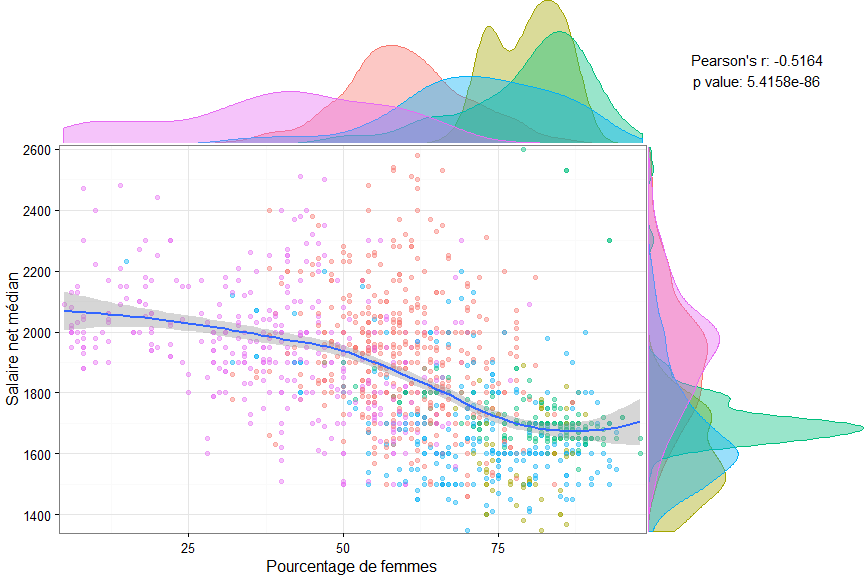

# Un outil d'analyse exploratoire avec Tableau et R
[Simon Keith](Profil publichttps://fr.linkedin.com/in/simonkth), [Actinvision](http://www.actinvision.fr/)  
16 mars 2016  
<br>  

# Introduction
### Vous avez dit analyse exploratoire ?
...  
<br>  

### Pourquoi Tableau est un bon candidat
...  
<br>  

### Prérequis
Tous des fichiers sont disponible dans ce [répertoire Github](https://github.com/simonkth/TableauR_ExploratoryAnalysis).  
Si vous souhaitez reproduire cet outil, assurez-vous de remplir les prérequis suivants avant de continuer :  

* avoir installé une version de Tableau Desktop supportant l'intégration avec R (8.1 ou supérieure)  
      + vous pouvez vous procurer une version d'essai à [cette adresse](http://get.tableau.com/fr-fr/partner-trial.html?partner=29294)  
* avoir installé R version 3.0.2 ou supérieure (disponible [ici](https://www.r-project.org/))  
* avoir ajouté R à votre variable d'environnement _path_ (par exemple, "C:\\Program Files\\R\\R-3.0.2\\bin\\x64")  
* avoir lancé Rserve en tâche d'arrière plan  
      + pour une configuration rapide et suffisante dans notre cas, téléchargez le contenu du [répertoire Github](https://github.com/simonkth/TableauR_ExploratoryAnalysis) et double-cliquez sur _Rserve.cmd_ dans le dossier _Rserve_ (ne fermez pas la fenêtre qui s'ouvre)  
      + pour une installation plus durable et plus flexible, suivez [ces instructions](http://kb.tableau.com/articles/knowledgebase/r-implementation-notes?lang=fr-fr)  
<br>  

# ...
...  
<br>  

# Jeu de données
### Origine et description
Le jeu de données que nous allons utiliser pour cette démonstration provient de la plateforme ouverte des [données publiques françaises](https://www.data.gouv.fr/fr/). Il contient un certain nombre d'indicateurs concernant l'insertion professionnelle des diplômés de Master en universités, fournis par le site de l'[enseignement supérieur français](www.enseignementsup-recherche.gouv.fr).  

Le jeu de données brut et sa documentation sont disponible [ici](https://www.data.gouv.fr/fr/datasets/insertion-professionnelle-des-diplomes-de-master-en-universites-et-etablissements-assimil-0/).  
<br>  

### Nettoyage et préparation avec R
Si le travail de préparation des données ne vous intéresse pas et que vous souhaitez directement attaquer les manipulations dans Tableau, vous pouvez passer cette section.  

Sinon, n'oubliez pas de configurer au préalable votre répertoire de travail avec la fonction `setwd`.  

Nous commençons par télécharger les données, puis nous réglons les problèmes de qualité des données. Nous supprimons ensuite les cas où le nombre de réponses est inférieur à 30, ainsi que ceux où le taux de réponse est inférieur à 30%. Nous sélection également les colonnes qui nous intéressent. Enfin, nous exportons un fichier _.csv_ pour Tableau et nous affichons un échantillon des données.  

```r
# load packages
if (!require("pacman")) install.packages("pacman")
pacman::p_load(downloader, data.table, dplyr)

# download and load the data (Windows setup)
if(!file.exists("./data/insertion_raw.csv")) {
      if(!file.exists("./data")) {dir.create("./data")}
      dataUrl <- paste0("https://data.enseignementsup-recherche.gouv.fr/explore/dataset/", 
                        "fr-esr-insertion_professionnelle-master/download?format=csv")
      download(dataUrl, dest="./data/insertion_raw.csv", mode="wb")
} else message("The dataset had previously been downloaded.")

# read data with fread(), with list of strings to ignore
insertion <- fread("./data/insertion_raw.csv", sep=";", encoding="UTF-8", 
                  na.strings=c("NA", "ns", "nd", "fe", ".", paste0(1, "\U00A0", 710), ""))

# remove data if sample is too small (nombre_de_reponses < 30) 
# or if the response rate is too low (taux_de_reponse < 30)
# also remove fields that we don't want to keep in Tableau
insertion <- insertion %>% 
      filter(nombre_de_reponses >= 30, taux_de_reponse >= 30, 
             numero_de_l_etablissement != "UNIV") %>%
      select(-c(numero_de_l_etablissement, code_de_l_academie, code_du_domaine, 
                code_de_la_discipline, remarque, cle_etab, cle_disc))
      
# export data in csv for Tableau
# note: we remove R "NAs" and replace with empty cells since Tableau doesn't handle them
insertion_noNa <- insertion
insertion_noNa[is.na(insertion_noNa)] <- ""
write.csv(insertion_noNa, "./data/insertion_Tableau.csv", row.names=FALSE)
remove(insertion_noNa)

# show sample
str(insertion)
```

```
## Classes 'data.table' and 'data.frame':	2177 obs. of  23 variables:
##  $ annee                                        : int  2012 2012 2012 2012 2012 2012 2012 2012 2012 2012 ...
##  $ etablissement                                : chr  "Saint-Etienne - Jean Monnet" "Saint-Etienne - Jean Monnet" "Strasbourg" "Toulon - Sud Toulon Var" ...
##  $ academie                                     : chr  "Lyon" "Lyon" "Strasbourg" "Nice" ...
##  $ domaine                                      : chr  "Droit, économie et gestion" "Droit, économie et gestion" "Sciences, technologies et santé" "Droit, économie et gestion" ...
##  $ discipline                                   : chr  "Ensemble formations juridiques, économiques et de gestion" "Autres formations juridiques, économiques et de gestion" "Informatique" "Gestion" ...
##  $ situation                                    : chr  "18 mois après le diplôme" "18 mois après le diplôme" "18 mois après le diplôme" "18 mois après le diplôme" ...
##  $ nombre_de_reponses                           : int  147 65 38 37 89 46 35 39 41 59 ...
##  $ taux_de_reponse                              : int  76 82 81 73 69 71 85 66 78 88 ...
##  $ poids_de_la_discipline                       : int  55 24 4 21 28 9 9 11 10 100 ...
##  $ taux_dinsertion                              : int  92 93 92 81 86 96 79 80 79 98 ...
##  $ emplois_cadre_ou_professions_intermediaires  : int  80 79 97 73 56 88 NA 74 90 89 ...
##  $ emplois_stables                              : int  64 63 82 47 58 79 NA 53 42 79 ...
##  $ emplois_a_temps_plein                        : int  98 96 100 100 83 95 NA 79 65 93 ...
##  $ salaire_net_median_des_emplois_a_temps_plein : int  1720 1730 NA NA 1380 1940 NA NA NA 1650 ...
##  $ salaire_brut_annuel_estime                   : int  26800 27000 NA NA 21500 30300 NA NA NA 25700 ...
##  $ de_diplomes_boursiers                        : int  31 31 23 40 37 40 27 27 27 42 ...
##  $ taux_de_chomage_regional                     : num  8.9 8.9 9.3 11.7 10.5 10.5 9.8 9.8 9.8 8.9 ...
##  $ salaire_net_mensuel_median_regional          : int  1780 1780 1760 1790 1760 1760 1780 1780 1780 1780 ...
##  $ emplois_cadre                                : int  45 42 93 26 39 74 NA 41 80 80 ...
##  $ emplois_exterieurs_a_la_region_de_luniversite: int  35 32 45 22 52 27 NA 63 62 8 ...
##  $ femmes                                       : int  53 60 7 75 79 54 51 87 85 88 ...
##  $ salaire_net_mensuel_regional_1er_quartile    : int  1430 1430 1430 1390 1420 1420 1460 1460 1460 1430 ...
##  $ salaire_net_mensuel_regional_3eme_quartile   : int  2130 2130 2080 2170 2090 2090 2110 2110 2110 2130 ...
##  - attr(*, ".internal.selfref")=<externalptr>
```
<br>  

# Développement des outils d'analyse
### ...
...  
<br>  

### Nuage de points et densitées marginales
L'un de mes premiers réflexes lorsque j'explore un nouveau jeu de données est de rechercher des relation entre les différentes variables. Pour les variables quantitatives, le nuage de point est un incontournable. Sur ce type de graphique, j'ai également tendance à utiliser la couleur pour comparer les différents niveaux d'une variable qualitative (ou dimension).  

Le problème avec les nuages de points, c'est qu'ils ont tendance à devenir rapidement illisibles lorsqu'il y a beaucoup d'éléments à afficher. Il est donc intéressant d'enrichir ces vues. On peut ainsi y ajouter différents éléments : une courbe de tendance, le résultat d'un test statistique, ou encore les densités marginales des nos variables...  

Ci-dessous une petite démonstration rapide en R avec le package _ggplot2_. J'ai ajouté une courbe de régression [LOESS](https://en.wikipedia.org/wiki/Local_regression), le résultat d'un [test de corrélation de Pearson](https://en.wikipedia.org/wiki/Pearson_product-moment_correlation_coefficient) ainsi que les [distributions marginales](https://en.wikipedia.org/wiki/Marginal_distribution) déclinées en couleur sur les différents domaines d'études proposés par nos universités. C'est une démonstration rapide, je n'ai donc pas pris la peine d'afficher la légende. Vous remarquerez aussi que cela demande beaucoup de code, et que l'alignement des différents éléments est assez approximatif.  

```r
# load packages for graphics
pacman::p_load(ggplot2, gridExtra)

# set variables
graphData <- data.frame(
      axisX=insertion$femmes,
      axisY=insertion$salaire_net_median_des_emplois_a_temps_plein, 
      colDim=insertion$domaine
      )
graphData <- graphData[complete.cases(graphData),]
axisNames <- c("Pourcentage de femmes", "Salaire net médian")

# helper function for graphic themes
myTheme <- function(...) theme(legend.position="none", 
                               panel.background=element_blank(), 
                               panel.grid.major=element_blank(), 
                               panel.grid.minor=element_blank(), 
                               panel.margin=unit(0, "null"), 
                               axis.ticks=element_blank(), 
                               axis.text.x=element_blank(), 
                               axis.text.y=element_blank(), 
                               axis.title.x=element_blank(), 
                               axis.title.y=element_blank(), 
                               panel.border=element_rect(color=NA), ...)

# plotting Pearson's correlation test
corTest <- with(graphData, cor.test(axisX, axisY, method="pearson"))
corText <- paste0("Pearson's r: ", formatC(corTest$estimate, digits=4, format="f"), 
                  "\np value: ", formatC(corTest$p.value, digits=4, format="e"))
gText <- ggplot() + 
  annotate("text", x=0, y=0, size=4, label=corText) + 
  theme_bw() + myTheme()

# scatterplot with LOESS smooth line
g1 <- ggplot(graphData, aes(x=axisX, y=axisY, colour=factor(colDim))) +
      geom_point(alpha=0.4, size=2) + 
      geom_smooth(aes(x=axisX, y=axisY), 
                  inherit.aes=FALSE, method="loess") +
      scale_x_continuous(expand=c(0.01, 0.01)) +
      scale_y_continuous(expand=c(0.01, 0.01)) +
      theme_bw() + xlab(axisNames[1]) + ylab(axisNames[2]) +
      theme(legend.position="none", plot.margin=unit(c(1, 1, 1, 1), "points"))

# x marginal density
g2 <- ggplot(graphData, aes(x=axisX, colour=factor(colDim), fill=factor(colDim))) + 
  geom_density(alpha=0.4) + 
  scale_x_continuous(breaks=NULL, expand=c(0.01, 0.01)) +
  scale_y_continuous(breaks=NULL, expand=c(0, 0)) +
  theme_bw() +
  myTheme(plot.margin=unit(c(0, 0, 0, 3), "lines")) 

# y marginal density
g3 <- ggplot(graphData, aes(x=axisY, colour=factor(colDim), fill=factor(colDim))) + 
  geom_density(alpha=0.4) + 
  coord_flip()  + 
  scale_x_continuous(labels=NULL, breaks=NULL, expand=c(0.01, 0.01)) +
  scale_y_continuous(labels=NULL, breaks=NULL, expand=c(0, 0)) +
  theme_bw() +
  myTheme(plot.margin=unit(c(0, 0, 2.1, 0), "lines"))

# arrange plots
remove(graphData, axisNames)
grid.arrange(arrangeGrob(g2, gText, ncol=2, widths=c(3, 1)), 
             arrangeGrob(g1, g3, ncol=2, widths=c(3, 1)), 
             heights=c(1, 3))
```


<br>  
Bien entendu ce code pourrait être grandement amélioré (ajout de la légende, alignement dynamique des différents éléments, etc.) mais vous avez compris le problème : c'est difficile à maintenir, et surtout cela manque cruellement d’interactivité. Je peux changer mes variables, mais pour cela je dois modifier puis relancer mon code. De plus, je ne suis pas sûr que l'alignement de mes graphiques restera bon. Je n'ai pas non plus la possibilité d'ajouter des infobulles ni de filtrer mes données... Bref, et si l'on essayait de porter tout cela dans Tableau ?

